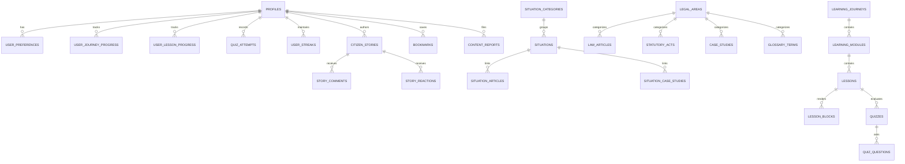

# Nyaya Revolution — Database Architecture & Schema Specification

**Document Version:** 1.0.0  
**Target Environment:** Supabase / PostgreSQL 15+  
**Status:** Production Grade  
**Domain Coverage:** Identity, Legal Knowledge, Situations, Learning Curriculum, Assessment, Progress & Gamification, Community, AI & Governance

---

## 1. Executive Summary & Architecture

Nyaya Revolution operates on a high-concurrency, security-first PostgreSQL data layer provisioned through Supabase. The database architecture is designed to support:
- **500+ Legal Situations** categorized across 11 citizen domains with emergency action plans and statutory backing.
- **Constitutional Articles & Statutory Acts** verified against official gazettes and legislative portals with tamper-evident audit trails.
- **Interactive Multi-Block Learning Journeys** with quizzes, certificates, and gamified XP/streak tracking.
- **Citizen Community Stories & Law Summaries** with automated/staff moderation and helpful voting.
- **Dual-Mode Adapter Pattern**: Seamless switching between live Supabase PostgreSQL (with strict Row Level Security) and offline verified static fixtures for zero-downtime static site generation (SSG) across all routes.

```
+-----------------------------------------------------------------------------------+
|                                  NEXT.JS APPLICATION                               |
|   (App Router, Server Actions, Dynamic Routes, Static Route Prerendering)         |
+-----------------------------------------+-----------------------------------------+
                                          |
                                          v
+-----------------------------------------------------------------------------------+
|                        SERVICE ADAPTER LAYER (src/services/db/)                   |
|   - situations.service.ts       - learning.service.ts      - legal-knowledge.ts   |
|   - progress.service.ts         - community.service.ts     - governance.service.ts|
+--------------------+------------------------------------+-------------------------+
                     |                                    |
     [isSupabaseConfigured = true]        [isSupabaseConfigured = false]
                     |                                    |
                     v                                    v
+-----------------------------------------+   +-------------------------------------+
|        SUPABASE CLIENT ARCHITECTURE     |   |      STATIC VERIFIED FIXTURES       |
|  - Browser Client (Anon Key + SSR Auth) |   |  - src/constants/laws.ts            |
|  - Server Client (Cookie-based SSR RLS) |   |  - src/constants/situations.ts      |
|  - Admin Client (Service Role Key only) |   |  - src/constants/learning.ts        |
+--------------------+--------------------+   +-------------------------------------+
                     |
                     v
+-----------------------------------------------------------------------------------+
|                               SUPABASE POSTGRESQL 15+                             |
|  - 38 Normalized Tables across 8 Core Domains                                    |
|  - Strict Row-Level Security (RLS) on Every Table                                 |
|  - Trigram & GIN Full-Text Search Indexes                                         |
|  - Atomic RPC Functions (record_quiz_attempt, increment_story_helpful)            |
+-----------------------------------------------------------------------------------+
```

---

## 2. Domain Data Models & Entity Relationships

The schema is partitioned into **8 Core Domains**:



---

## 3. Table Schemas, Constraints & Enums

### 3.1 Custom Enums
```sql
CREATE TYPE user_role AS ENUM ('citizen', 'advocate', 'legal_educator', 'admin');
CREATE TYPE verification_status AS ENUM ('draft', 'needs_review', 'verified', 'published', 'archived');
CREATE TYPE legal_area_id AS ENUM (
  'constitutional', 'criminal', 'consumer', 'cyber', 'labour',
  'housing', 'traffic', 'civil', 'privacy', 'family', 'education'
);
CREATE TYPE difficulty_level AS ENUM ('beginner', 'intermediate', 'advanced');
CREATE TYPE moderation_status AS ENUM ('pending', 'approved', 'flagged', 'rejected');
CREATE TYPE resolution_status AS ENUM ('resolved', 'ongoing', 'mediated');
CREATE TYPE journey_progress_status AS ENUM ('not_started', 'in_progress', 'completed');
CREATE TYPE source_type AS ENUM (
  'constitution', 'central_act', 'state_act', 'supreme_court',
  'high_court', 'official_gazette', 'ministry_rule', 'institutional'
);
```

### 3.2 Key Domain Tables

#### `profiles` (Domain 1: Identity & Profiles)
| Column | Type | Constraints | Description |
|---|---|---|---|
| `id` | UUID | PK, REFERENCES auth.users(id) ON DELETE CASCADE | Matches Supabase Auth user ID |
| `email` | TEXT | NOT NULL, UNIQUE | User primary email |
| `full_name` | TEXT | NULL | Display name |
| `avatar_url` | TEXT | NULL | Public avatar CDN URL |
| `role` | user_role | NOT NULL DEFAULT 'citizen' | Authorization role |
| `jurisdiction_state` | TEXT | NULL | Indian State / UT for local laws |
| `xp_points` | INT | NOT NULL DEFAULT 0 | Gamification points |
| `level` | INT | NOT NULL DEFAULT 1 | User progression level |
| `created_at` | TIMESTAMPTZ | NOT NULL DEFAULT now() | Signup timestamp |
| `updated_at` | TIMESTAMPTZ | NOT NULL DEFAULT now() | Profile update timestamp |

#### `law_articles` (Domain 2: Legal Knowledge Repository)
| Column | Type | Constraints | Description |
|---|---|---|---|
| `id` | UUID | PK DEFAULT gen_random_uuid() | Unique identifier |
| `slug` | TEXT | NOT NULL, UNIQUE | URL-safe slug |
| `title` | TEXT | NOT NULL | Article/Section title |
| `article_or_section` | TEXT | NOT NULL | e.g. "Article 21", "Section 43A" |
| `legal_area_id` | legal_area_id | NOT NULL | Categorization |
| `simple_explanation` | TEXT | NOT NULL | Citizen-first plain summary |
| `detailed_explanation`| TEXT | NOT NULL | Comprehensive statutory context |
| `why_it_exists` | TEXT | NOT NULL | Historical/constitutional rationale |
| `who_it_protects` | TEXT | NOT NULL | Target protected class |
| `real_world_example` | TEXT | NOT NULL | Real life scenario |
| `myth` | TEXT | NULL | Common citizen misconception |
| `reality` | TEXT | NULL | Legal reality |
| `derived_rights` | TEXT[] | NOT NULL DEFAULT '{}' | Associated fundamental/statutory rights |
| `verification_status`| verification_status | NOT NULL DEFAULT 'draft' | Content review lifecycle |
| `search_vector` | TSVECTOR | GENERATED ALWAYS AS (...) STORED | Full-text search index |

#### `situations` (Domain 3: Situational Knowledge)
| Column | Type | Constraints | Description |
|---|---|---|---|
| `id` | UUID | PK DEFAULT gen_random_uuid() | Unique identifier |
| `slug` | TEXT | NOT NULL, UNIQUE | Situation URL slug |
| `title` | TEXT | NOT NULL | First-person citizen title |
| `category_id` | TEXT | NOT NULL REFERENCES situation_categories(id) | Domain category |
| `tagline` | TEXT | NOT NULL | Concise 1-liner summary |
| `summary` | TEXT | NOT NULL | Detailed situational context |
| `rights` | TEXT[] | NOT NULL DEFAULT '{}' | Guaranteed citizen rights |
| `laws` | JSONB | NOT NULL DEFAULT '[]' | Applicable statutory sections |
| `immediate_actions` | TEXT[] | NOT NULL DEFAULT '{}' | Immediate steps to take |
| `dont_do` | TEXT[] | NOT NULL DEFAULT '{}' | Critical mistakes to avoid |
| `documents` | TEXT[] | NOT NULL DEFAULT '{}' | Evidence/documents required |
| `authorities` | JSONB | NOT NULL DEFAULT '[]' | Competent forums/authorities |
| `emergency_contacts` | JSONB | NOT NULL DEFAULT '[]' | Emergency hotlines/portals |
| `search_vector` | TSVECTOR | GENERATED ALWAYS AS (...) STORED | Full-text search index |

#### `citizen_stories` (Domain 7: Community & Citizen Voice)
| Column | Type | Constraints | Description |
|---|---|---|---|
| `id` | UUID | PK DEFAULT gen_random_uuid() | Unique identifier |
| `author_id` | UUID | REFERENCES profiles(id) ON DELETE CASCADE | Author user ID |
| `author_name` | TEXT | NOT NULL | Display name |
| `author_role` | TEXT | NOT NULL | Citizen badge / role |
| `author_initials` | TEXT | NOT NULL | 2-character avatar initials |
| `category` | TEXT | NOT NULL | Situation or legal category |
| `title` | TEXT | NOT NULL | Story headline |
| `what_happened` | TEXT | NOT NULL | Narrative context |
| `action_taken` | TEXT | NOT NULL | Legal steps taken |
| `legal_outcome` | TEXT | NOT NULL | Result or settlement |
| `resolution_status` | resolution_status | NOT NULL DEFAULT 'resolved' | Status of resolution |
| `helpful_count` | INT | NOT NULL DEFAULT 0 | Helpful upvotes |
| `moderation_status` | moderation_status | NOT NULL DEFAULT 'pending' | Content moderation state |

---

## 4. Indexing & Full-Text Search Strategy

### 4.1 Full-Text Search (`tsvector` & GIN)
Full-text search uses PostgreSQL `english` configuration with weighted vectors:
- **Weight A**: Title, Article number, Act name, Situation title.
- **Weight B**: Tagline, Short summary, Citations.
- **Weight C**: Detailed explanations, Rationale, Real world examples.

```sql
-- Generated search column on law_articles:
ALTER TABLE law_articles ADD COLUMN search_vector tsvector
GENERATED ALWAYS AS (
  setweight(to_tsvector('english', coalesce(title, '')), 'A') ||
  setweight(to_tsvector('english', coalesce(article_or_section, '')), 'A') ||
  setweight(to_tsvector('english', coalesce(simple_explanation, '')), 'B') ||
  setweight(to_tsvector('english', coalesce(detailed_explanation, '')), 'C')
) STORED;

CREATE INDEX idx_law_articles_fts ON law_articles USING GIN (search_vector);
```

### 4.2 Composite & Relational Indexes
```sql
CREATE INDEX idx_law_articles_area ON law_articles(legal_area_id);
CREATE INDEX idx_law_articles_status ON law_articles(verification_status);
CREATE INDEX idx_situations_cat ON situations(category_id);
CREATE INDEX idx_lessons_journey_mod ON lessons(journey_id, module_id);
CREATE INDEX idx_user_progress_composite ON user_lesson_progress(user_id, is_completed);
CREATE INDEX idx_quiz_attempts_user_quiz ON quiz_attempts(user_id, quiz_id);
CREATE INDEX idx_bookmarks_user_type ON bookmarks(user_id, content_type);
CREATE INDEX idx_citizen_stories_mod ON citizen_stories(moderation_status, created_at DESC);
```

---

## 5. Row-Level Security (RLS) Policies

Every single table in the schema has `ALTER TABLE <table_name> ENABLE ROW LEVEL SECURITY;`.

### 5.1 Helper Functions
```sql
CREATE OR REPLACE FUNCTION is_admin()
RETURNS BOOLEAN AS $$
  SELECT EXISTS (
    SELECT 1 FROM profiles
    WHERE id = auth.uid() AND role = 'admin'
  );
$$ LANGUAGE sql SECURITY DEFINER;

CREATE OR REPLACE FUNCTION is_staff()
RETURNS BOOLEAN AS $$
  SELECT EXISTS (
    SELECT 1 FROM profiles
    WHERE id = auth.uid() AND role IN ('advocate', 'legal_educator', 'admin')
  );
$$ LANGUAGE sql SECURITY DEFINER;
```

### 5.2 Policy Matrix
| Table | Public Read | Authenticated Insert | Owner Update/Delete | Admin / Staff |
|---|---|---|---|---|
| `profiles` | Public (Display fields) | Auto (Auth trigger) | Self only (`id = auth.uid()`) | Admin full |
| `user_preferences` | None | Self only | Self only | Admin full |
| `law_articles` | Published only (`verification_status = 'published'`) | None | None | Staff can edit, Admin can publish |
| `situations` | Published only | None | None | Staff / Admin |
| `lessons` | Public read | None | None | Staff / Admin |
| `user_lesson_progress` | None | Self (`user_id = auth.uid()`) | Self | Admin full |
| `quiz_attempts` | None | Self (`user_id = auth.uid()`) | None (Immutable) | Admin full |
| `bookmarks` | None | Self (`user_id = auth.uid()`) | Self | None |
| `citizen_stories` | Approved only (`moderation_status = 'approved'`) | Authenticated | Self (if pending) | Staff/Admin moderate |
| `audit_events` | None | Server only (SECURITY DEFINER) | None (Append-only) | Admin read-only |

---

## 6. Stored Procedures & Triggers

### 6.1 Automatic User Profile Creation
When a new user signs up via Supabase Auth (`auth.users`), the `handle_new_user` trigger automatically provisions their profile and preferences:
```sql
CREATE OR REPLACE FUNCTION public.handle_new_user()
RETURNS TRIGGER AS $$
BEGIN
  INSERT INTO public.profiles (id, email, full_name, role)
  VALUES (
    NEW.id,
    NEW.email,
    COALESCE(NEW.raw_user_meta_data->>'full_name', NEW.raw_user_meta_data->>'name'),
    'citizen'
  );

  INSERT INTO public.user_preferences (user_id)
  VALUES (NEW.id);

  INSERT INTO public.user_streaks (user_id)
  VALUES (NEW.id);

  RETURN NEW;
END;
$$ LANGUAGE plpgsql SECURITY DEFINER;

CREATE TRIGGER on_auth_user_created
  AFTER INSERT ON auth.users
  FOR EACH ROW EXECUTE FUNCTION public.handle_new_user();
```

### 6.2 Atomic Helpful Voting (`increment_story_helpful`)
Prevents race conditions when concurrent users upvote a story:
```sql
CREATE OR REPLACE FUNCTION increment_story_helpful(story_id UUID, delta INT)
RETURNS INT AS $$
DECLARE
  new_count INT;
BEGIN
  UPDATE citizen_stories
  SET helpful_count = GREATEST(0, helpful_count + delta)
  WHERE id = story_id
  RETURNING helpful_count INTO new_count;
  RETURN new_count;
END;
$$ LANGUAGE plpgsql SECURITY DEFINER;
```

### 6.3 Atomic Quiz Attempt & XP Recording (`record_quiz_attempt`)
Persists quiz scores, updates user XP, and recomputes user level in a single transaction:
```sql
CREATE OR REPLACE FUNCTION record_quiz_attempt(
  p_quiz_id TEXT,
  p_score INT,
  p_max_score INT,
  p_passed BOOLEAN,
  p_xp INT
)
RETURNS UUID AS $$
DECLARE
  v_user_id UUID := auth.uid();
  v_attempt_id UUID;
  v_new_xp INT;
  v_new_level INT;
BEGIN
  IF v_user_id IS NULL THEN
    RAISE EXCEPTION 'Not authenticated';
  END IF;

  INSERT INTO quiz_attempts (user_id, quiz_id, score, max_score, passed, xp_earned)
  VALUES (v_user_id, p_quiz_id, p_score, p_max_score, p_passed, p_xp)
  RETURNING id INTO v_attempt_id;

  UPDATE profiles
  SET xp_points = xp_points + p_xp,
      level = 1 + FLOOR((xp_points + p_xp) / 250),
      updated_at = NOW()
  WHERE id = v_user_id
  RETURNING xp_points, level INTO v_new_xp, v_new_level;

  RETURN v_attempt_id;
END;
$$ LANGUAGE plpgsql SECURITY DEFINER;
```

---

## 7. Migration Runbook

All database migrations are maintained in version-controlled SQL files under `supabase/migrations/`:
1. `20260923000001_initial_schema.sql`: Extensions, enums, tables, foreign keys, constraints.
2. `20260923000002_indexes_and_search.sql`: Performance indexes, composite indexes, FTS generated columns, GIN indexes.
3. `20260923000003_row_level_security.sql`: RLS enablement and comprehensive security policies across all tables.
4. `20260923000004_functions_and_triggers.sql`: Triggers, auto-timestamp updates, RPC functions.

### Applying Migrations Locally
```bash
# Start local Supabase container
npx supabase start

# Apply all pending migrations
npx supabase db reset

# Seed verified legal database fixtures
npx supabase db seed
```

### Linking & Deploying to Production Supabase
```bash
# Link local CLI to production project
npx supabase link --project-ref <PROJECT_ID>

# Push migrations to remote database
npx supabase db push

# Verify RLS policies are intact
npx supabase db lint
```

---

## 8. Backup & Content Integrity Policies

1. **Daily Automated Backups**: Point-in-time recovery (PITR) enabled via Supabase Managed PostgreSQL.
2. **Tamper-Evident Content Audits**: All mutations to statutory articles, judgments, and legal guidance generate immutable records in `content_verification_logs` with verified source citations, author IDs, and timestamps.
3. **Zero Untrusted Legal Advice**: Automated tests verify that no AI responses or community submissions are auto-published without statutory backing or staff review.
